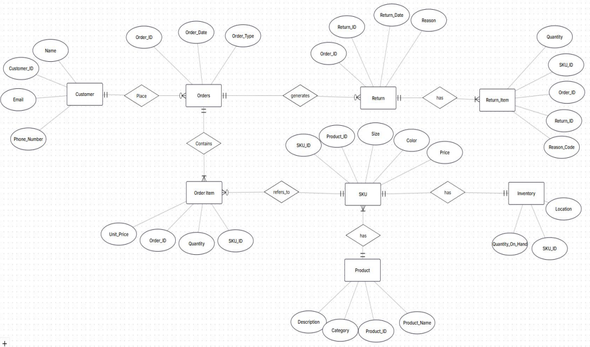
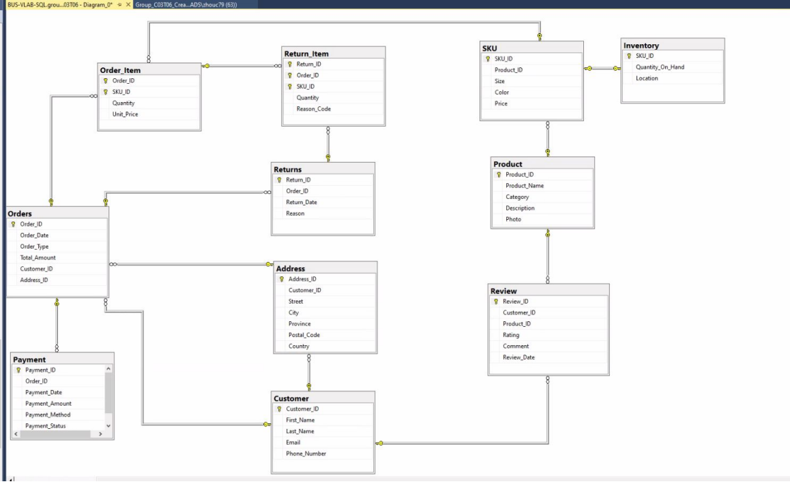
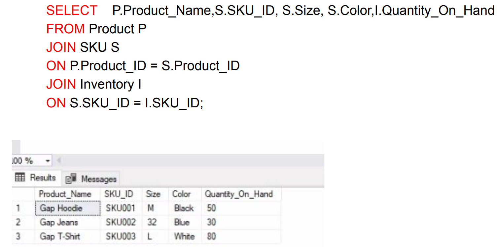

# Retail Commerce Database Management System

This project designs and implements a relational SQL database system for retail inventory and sales operations using Microsoft SQL Server (SSMS) and ERDPlus. The system supports customer management, inventory tracking, order processing, payments, returns, product reviews, and operational reporting workflows.

## Tools & Technologies
- Microsoft SQL Server
- SQL Server Management Studio (SSMS)
- ERDPlus
- SQL

## Business Problem
Retail organizations rely on structured relational database systems to efficiently manage customer transactions, inventory, order processing, payments, returns, and operational reporting.

## Project Overview
The database system was designed to support customer management, inventory tracking, product catalog management, order processing, payments, returns, and product reviews. The project includes ERD development, relational schema development, database normalization, primary and foreign key constraints, referential integrity, domain constraints, and SQL query implementation.

## Database Design Summary
- 11 core business entities
- Third Normal Form (3NF) database design
- Primary and foreign key relationships
- Referential integrity constraints
- Domain constraints
- SQL reporting queries

## Key Features
- Designed entity-relationship diagrams (ERDs) for retail operations
- Developed normalized relational schemas (3NF) with primary keys, foreign keys, and referential integrity constraints
- Modeled customers, products, inventory, orders, payments, returns, and reviews
- Implemented referential integrity and domain constraints
- Created multi-table SQL queries using JOINs and filtering to support inventory, product, and operational reporting
- Supported inventory tracking and retail transaction workflows

## Business Value
The database supports inventory management, sales reporting, customer transaction tracking, and operational decision-making through structured relational database design, normalized schemas, and SQL-based reporting.

## Sample SQL Query

The following query joins the `Product`, `SKU`, and `Inventory` tables to produce an inventory report showing each product variation and its current stock level.

```sql
SELECT
    P.Product_Name,
    S.SKU_ID,
    S.Size,
    S.Color,
    I.Quantity_On_Hand
FROM Product AS P
JOIN SKU AS S
    ON P.Product_ID = S.Product_ID
JOIN Inventory AS I
    ON S.SKU_ID = I.SKU_ID;
```

## Skills Demonstrated
- SQL
- Database Design
- Entity-Relationship Diagrams (ERD)
- Relational Schema Design
- Database Normalization
- Referential Integrity
- SQL Query Development

## Database Design

### Entity Relationship Diagram


### Relational Schema


### Sample SQL Query Output

